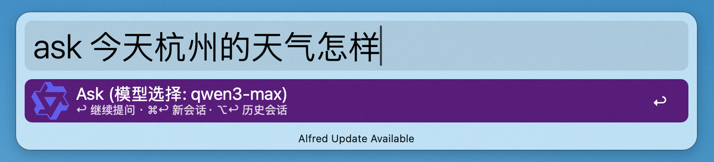
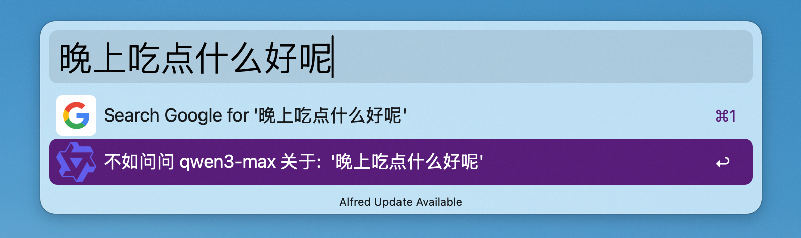
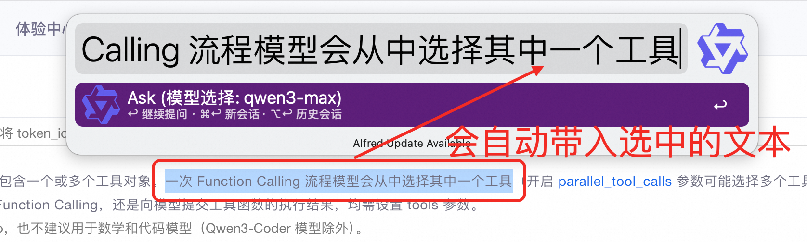
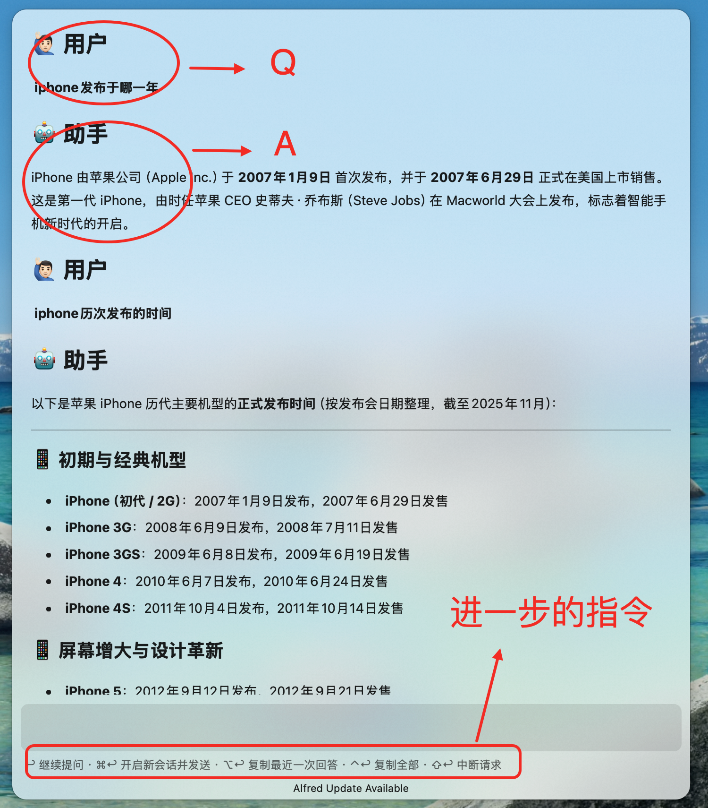
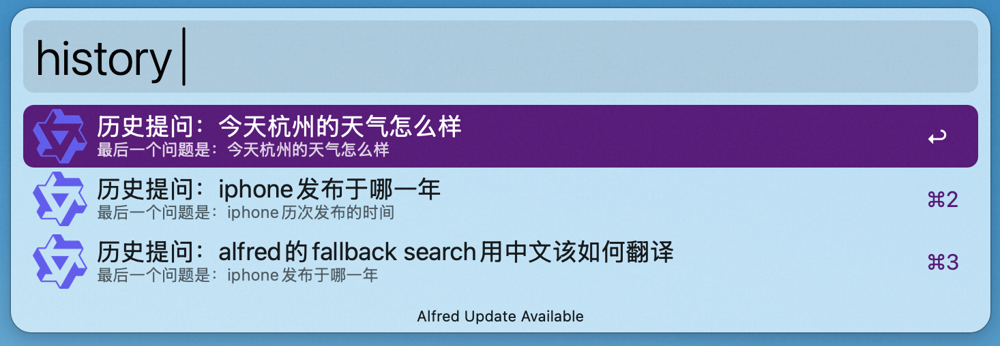
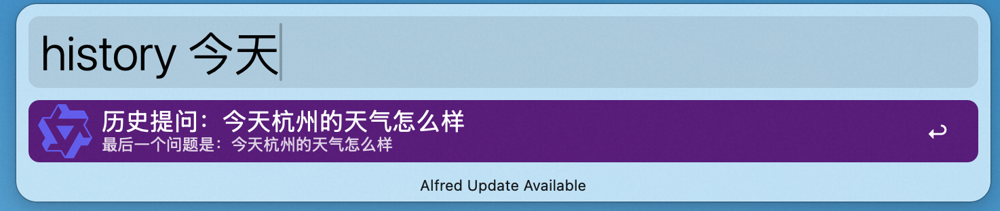
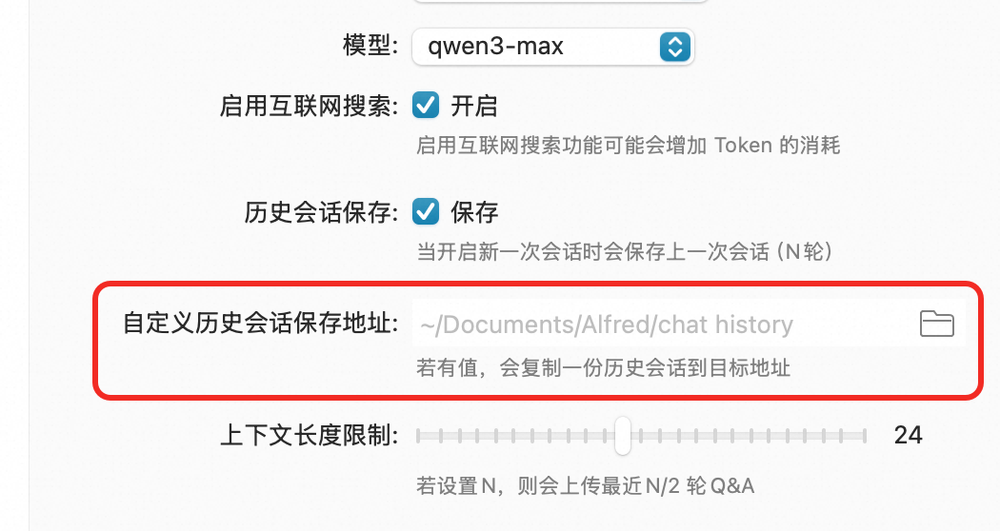
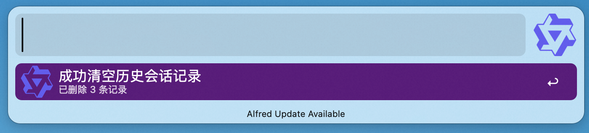

#  Ask Qwen

基于 [ChatGPT / DALL-E Alfred Workflow](https://github.com/alfredapp/openai-workflow/) 做了迭代

## 下载workflow

[点击下载](https://raw.githubusercontent.com/HuangAndMC/ask-qwen-workflow/refs/heads/main/Release/Ask%20Qwen_v1.alfredworkflow)

## 新增Feature
1. 触发方式：支持了 选中文本 → 快捷键直接触发对话框并带入query → 提问
2. 模型适配：
   1. 新增了对通义qwen模型、DeepSeek模型的适配
   2. 新增了开启互联网搜索的功能
   3. 如果非预设的 model & endpoint 的话，支持配置强制覆盖以适配不在配置项中的模型
3. 历史会话：
   1. 支持快捷键直接打开历史会话列表
   2. 新增了一个配置项（自定义历史会话保存），配置后脚本中会额外备份一份到目标地址
   3. 新增了一条流程，支持清空历史会话记录
4. 结果通知：在使用`⌥`等跟进操作复制了answer、清空了历史会话后增加了macos的结果通知

## 一、设置

1. 创建百炼账号并[登录](https://bailian.console.aliyun.com/?tab=home#/home)
2. 点击[模型服务-秘钥管理](https://bailian.console.aliyun.com/?tab=model#/api-key), 新建秘钥并复制
3. 获取API平台的的`endpoint`
4. 复制`apiKey`和`endpoint`，粘贴在workflow的配置项里即可

> 其他平台如[DeepSeek开放平台](https://platform.deepseek.com/sign_in)也是类似的操作

## 二、使用

### 1. 触发Chat

workflow有三种触发方式：

1. 唤起alfred对话框后，可以通过关键词触发（默认是`ask`, 支持修改）

2. 唤起alfred对话框后，配置[兜底召回(Fallback Search)](https://www.alfredapp.com/help/features/default-results/fallback-searches/)触发

3. 选中任意文字，通过快捷键触发（默认是`⌥/`，支持修改）

### 2. 对话界面

对话面板：

进一步的指令：
* <kbd>↩</kbd> 继续提问
* <kbd>⌘</kbd><kbd>↩</kbd> 开启一个新会话
* <kbd>⌥</kbd><kbd>↩</kbd> 复制最近一次的回答
* <kbd>⌃</kbd><kbd>↩</kbd> 复制全部对话内容
* <kbd>⇧</kbd><kbd>↩</kbd> 中断请求

### 3. 历史会话

开启新会话后，会将上一轮的对话保存到history中，检索历史会话支持两种触发方式：

1. 通过`ask`关键词触发workflow后再按下`⌥↩`可检索出历史会话
2. 通过单独的`history`关键词直接检索

回车后可打开对话面板，可以基于历史会话自动带入上下文重新对话

历史会话支持基于首问和末次问的问题进行检索匹配

历史会话允许用户在其他地方保留一个副本

历史会话支持清空，但是清空的只是workflow内部文件(`${envVar("alfred_workflow_data")}/archive`)，用户自定义的副本不会被清空

